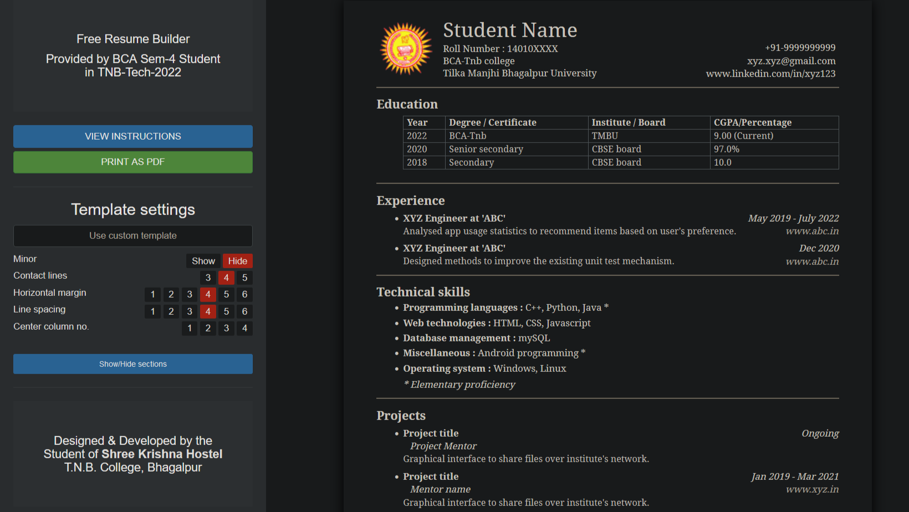

# Resume Builder

_Author : Vikas Anand_

## We Made a Free Resume Builder for TNB-Tech-2022 Using Html and Css only. 
  
Try it : https://kingcoolvikas.github.io/TNB-Tech-Resume-Builder/ 

**Note** : Click the "VIEW INSTRUCTIONS" button in the editor to read usage instructions.

#### Features
- Resume content can be edited just like a normal document editor (cut,copy,undo etc).
- Entire sections can be added, reordered, removed just by cut,copy,pasting method.
- Section visibility can be toggled while retaining the content.
- Options provided in the left panel to modify the template and formatting.
- Sub-points can be added with various bullet styles and adjustable indentation.

